 

<center>本科实验报告<center>

 

 

 

| 课程名称 | 编译原理                            |
| -------- | ----------------------------------- |
| 姓  名   | 曹田雨，高珂，许恩宁                |
| 学  院   | 计算机学院                          |
| 系       | 计算机系                            |
| 专  业   | 计算机科学与技术                    |
| 学  号   | 3200105453， 3200105111，3200102872 |
| 指导教师 | 邓水光                              |


## 序言

### 0.1 概述

我们所实现的编译器是三个大组件组成，数据以pipeline的方式从一个到另一个。我们使用不同的工具来帮助我们建立这些组件中的每一个。下面是每个步骤和我们将使用的工具的图示：


我们**使用Flex进行词法分析**：将输入数据分割成一组tokens（标识符、关键词、数字、大括号、小括号等）。**用Bison进行语义分析**：在解析标记的同时生成一个AST。Bison将在这里做大部分的工作，我们只需要定义我们的AST。**用LLVM汇编**： 我们遍历AST的每个结点，并为每个结点生成机器码。

### 0.2 运行环境

包依赖：`Flex`, `Bison`, `LLVM`

基于C/C++，我们使用了`Cmake` 配置工程，理论上可以在多个平台上构建编译运行。

### 0.3 文件说明

XXXXXX

### 0.4 分工

| 成员   | 分工 |
| ------ | ---- |
| 曹田雨 |      |
| 高珂   |      |
| 许恩宁 |      |


## 1 词法分析 Lex

### 1.1 正规表达式

```c
alpha       [a-zA-Z_]
digits      [0-9]
alnum       [a-zA-Z0-9_]

%%
[ \t\n]                                                 ;
{alpha}({alnum}*)                                       { SAVE_TOKEN; return IDENTIFIER;}
({digits}+"."{digits}*)|({digits}*"."{digits}+)         { SAVE_TOKEN; return TFLOAT;}
[1-9]{digits}*                                          { SAVE_TOKEN; return TINTEGER;}
	// matches either a single character enclosed in single quotes or an escape sequence enclosed in single quotes
\'.\'|\'\\.\'                                           { SAVE_TOKEN; return TCHAR;} 
\"(\\.|[^"\\])*\"                                       { SAVE_TOKEN; return TSTRING;}

"&&"            { return TOKEN(AND); }
"||"            { return TOKEN(OR); }
"<"             { return TOKEN(LE); }
">"             { return TOKEN(GT); }
"<="            { return TOKEN(LEQ); }
">="            { return TOKEN(GEQ); }
"=="            { return TOKEN(EQU); }
"!="            { return TOKEN(NEQ); }
";"             { return TOKEN(';'); }
"{"             { return TOKEN('{'); }
"}"             { return TOKEN('}'); }
","             { return TOKEN(','); }
":"             { return TOKEN(':'); }
"="             { return TOKEN('='); }
"("             { return TOKEN('('); }
")"             { return TOKEN(')'); }
"["             { return TOKEN('['); }
"]"             { return TOKEN(']'); }
"."             { return TOKEN('.'); }
"&"             { return TOKEN(GAD); }
"!"             { return TOKEN(NOT); }
"~"             { return TOKEN('~'); }
"-"             { return TOKEN(MINUS); }
"+"             { return TOKEN(PLUS); }
"*"             { return TOKEN(MUL); }
"/"             { return TOKEN(DIV); }
"%"             { return TOKEN('%'); }
"^"             { return TOKEN('^'); }
"|"             { return TOKEN('|'); }
"?"             { return TOKEN('?'); }

"if"        	{ return TOKEN(IF); }
"else"      	{ return TOKEN(ELSE); }
"while"     	{ return TOKEN(WHILE); }
"break"     	{ return TOKEN(BREAK); }
"return"    	{ return TOKEN(RETURN); }

.               { printf("Unknown token: %s in line: %d\n", yytext, yylineno); }

%%
```


### 1.2 实现原理和方法

#### 1.2.1 Flex

- Flex（Flexible Scanner）是一种快速词法分析器生成器，用于生成用于解析文本的词法分析器。词法分析器是编译器中的一个组件，负责将输入文本分解为标记（tokens），以便后续的语法分析。

  Flex使用基于正则表达式的模式匹配技术，将输入文本分解成标记序列。它生成的词法分析器是C或C++语言的源代码，可以与编译器的其他组件集成。

- Lex输入文件 (a.l) 格式

  ```
  {definitions}
  %%
  {rules}
  %%
  {auxiliary routines}
  ```

#### 1.2.2 语言：类C

我们实现一种类C语言，实现了C语言的功能。我们支持的tokens有：

```
int, float, char, string
+, -, *, /, ==, >=, <=, <, >, !=, !, &(取地址), =
||, &&
array, func
if, else, while, break, return
```


## 2 语法分析 Yacc (Bison)

### 2.1 上下文无关文法 Context-free Language

```c
program:
    statements
    ;

statements: 
    stmt
    | statements stmt
    ;

block:
    '{' statements '}' 
    | '{' '}' 
    ;

stmt: 
    var_decl ';' 
    | func_decl
    | expr ';' 
    | IF '(' expr ')' block 
    | IF '(' expr ')' block ELSE block 
    | WHILE '(' expr ')' block 
    | BREAK ';' 
    | RETURN ';' 
    | RETURN expr ';' 
    ;
    
var_decl:
    ident ident  // int a;
    | ident ident '=' expr  // int a = b + 2;
    | ident ident '[' TINTEGER ']'  // int a[10]
    ;

func_decl:
    ident ident '(' func_decl_args ')' block  // int f(args){}
    ;

func_decl_args:
    /*no args*/  // no args
    | var_decl  // int a
    | func_decl_args ',' var_decl  // int a, int b
    ;

ident:
    IDENTIFIER 
    ;

const_value:
    TINTEGER 
    | TFLOAT 
    | TCHAR 
    | TSTRING ;
    ;

expr:
    const_value // 12
    | expr PLUS expr  
    | expr MINUS expr  
    | expr MUL expr  
    | expr DIV expr  
    | expr EQU expr  
    | expr LEQ expr  
    | expr GEQ expr  
    | expr NEQ expr  
    | expr LE expr  
    | expr GT expr  
    | expr AND expr  
    | expr OR expr  
    | '(' expr ')'  // (a+b)
    | ident '=' expr  // a = a + 2
    | ident '(' ')' 
    | ident '(' call_args ')'  // f(a, b)
    | ident  // a
    | ident '[' expr ']' 
    | ident '[' expr ']' '=' expr 
    | GAD ident 
    | GAD ident '[' expr ']' 
    ;

call_args:
    /*no args*/ 
    | expr 
    | call_args ',' expr 
    ;

```


### 2.2 实现原理和方法

#### 2.2.1 Yacc

Yacc（Yet Another Compiler Compiler）是一个用于生成语法分析器的工具，用于解析和处理上下文无关文法（Context-Free Grammar）。Yacc接受一个文法规范作为输入，并生成用于解析该文法的语法分析器代码。语法分析器用于将输入的符号序列（通常是由词法分析器生成的标记序列）转换为语法结构，例如抽象语法树（Abstract Syntax Tree）。

#### 2.2.2 Bison

Bison是GNU计划中的一个工具，用于生成语法分析器（parser）代码。它是在Yacc（Yet Another Compiler Compiler）的基础上开发的，并提供了一些额外的功能和改进。

Bison接受一个文法规范作为输入，并生成用于解析该文法的语法分析器代码。类似于Yacc，Bison也使用LALR（Look-Ahead Left-to-Right Rightmost derivation）算法进行语法分析。与Flex类似，Bison的输入文件也由3段组成，用%%分隔：

```
{definitions}
%%
{rules}
%%
{user's code}
```

#### 2.2.3 AST

Flex 和 Bison 将输入的程序文本解析为抽象语法树 (AST, Abstract Syntax Tree)的形式。以下是我们定义的语法树的结点类型：

